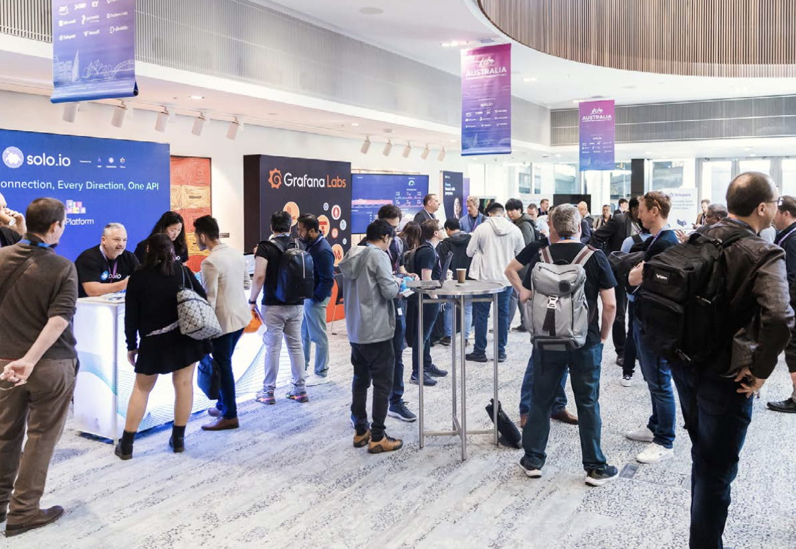

---
hide:
  - toc
  - navigation
---

# CloudCon Sydney 2025

Join us on 9th & 10th September 2025 for CloudCon Sydney which brings together international and local experts with adopters, developers, and practitioners in an accessible and compact format. CloudCon is designed to promote face-to-face collaboration and deliver rich educational experiences. 

At the event, attendees can engage with the leaders of Kubernetes and other projects and help set direction for the cloud native ecosystem in Australia. 

CloudCon Sydney 2025 is aimed at a diverse and technical audience, eager to advance their cloud-native expertise, collaborate with peers, and explore the cutting edge of industry best practices in Australia. If you're passionate about shaping the future of digital infrastructure and applications, this conference is for you.  

Our program delves into critical themes of Kubernetes, AI & ML, Platform Engineering, and Security, making it an essential event for various roles across a wide range of organizations.  

## Questions?

Please contact the organisers via email: `organizers@kcdaustralia.onmicrosoft.com`